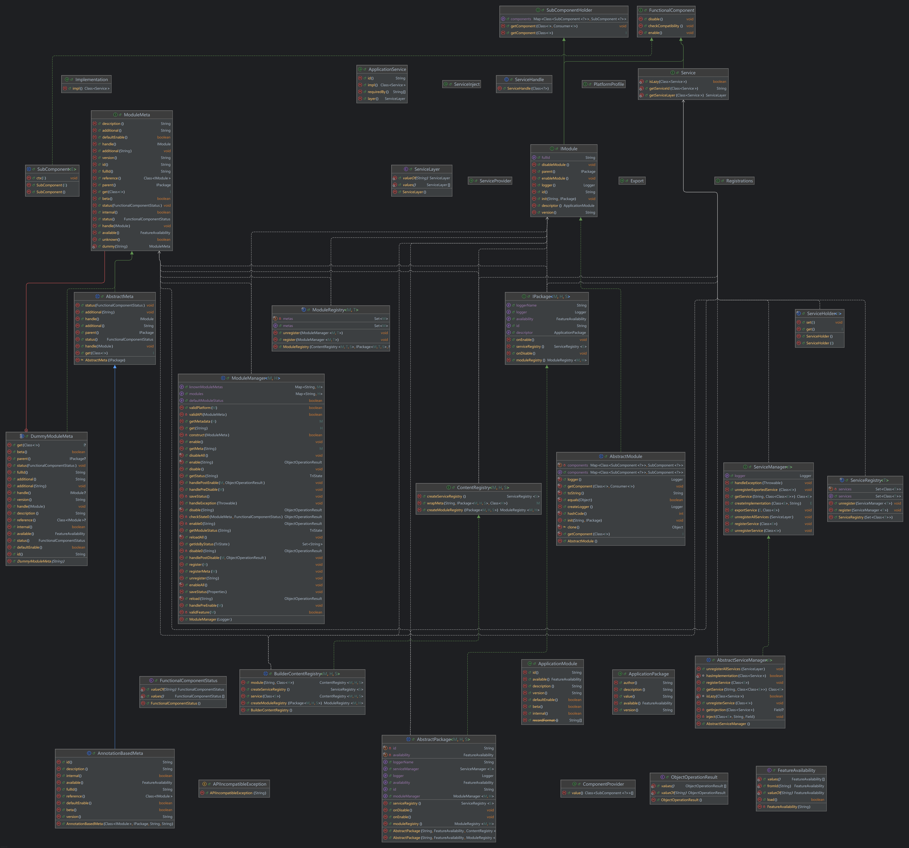

<h2 align="center">Modular</h2>

Module-based general application framework.

[Explore docs]() | [Report issue]()

### Description

Yep just an abstracted layer of modular program framework :D

### Architecture

Program UML map fully ↓

